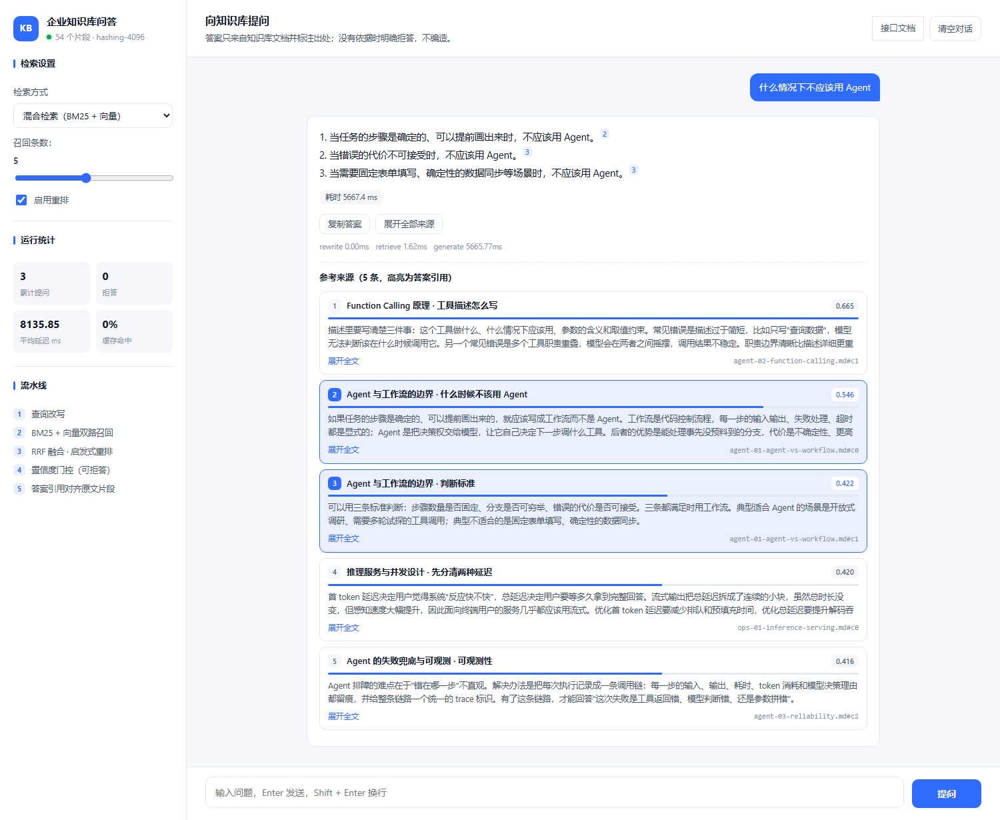
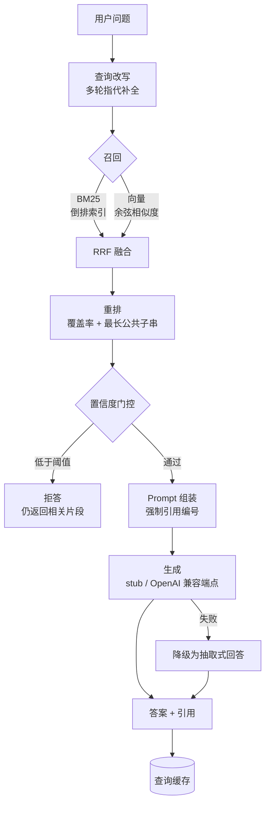

# kb-agent

企业知识库问答服务：**混合检索 + Agent 编排 + 可复现评测**。

大多数 RAG 项目止步于"能跑通一个 demo"。这个项目多做了一件事：**把检索选型变成可以测量的结论**。
仓库自带 18 篇知识库文档、50 条评测查询和完整的消融脚本，`clone` 下来不需要任何 API Key 和网络，
就能复现下面每一个数字。

[](https://github.com/zhouyi041025/kb-agent/actions/workflows/ci.yml)



自带网页控制台：提问、逐条查看召回片段与相关性分数、点击引用跳转到原文，
还能实时切换检索方式、top-k 和重排开关，观察拒答与耗时统计。
截图是接上真实模型（智谱免费档 `glm-4-flash`）后的效果；下面评测用的离线基线是另一套设定，见「接上真实模型之后」。

## 评测结果

50 条查询（42 条可回答 + 8 条知识库里没有答案），top_k=5，拒答阈值 0.45，
离线确定性向量（4096 维哈希），抽取式生成：

| 配置 | Recall@1 | Recall@5 | MRR | 引用准确率 | 拒答正确率 | 误答率 | 漏答率 |
| --- | --- | --- | --- | --- | --- | --- | --- |
| 纯向量检索 | 0.762 | 0.929 | 0.833 | 0.702 | 0.875 | 0.125 | 0.214 |
| 纯 BM25 | 0.857 | 0.976 | 0.904 | 0.724 | 0.625 | 0.375 | 0.095 |
| 纯向量 + 重排 | **0.881** | 0.929 | 0.905 | 0.715 | 0.750 | 0.250 | 0.095 |
| 纯 BM25 + 重排 | 0.857 | **0.976** | 0.904 | 0.724 | 0.625 | 0.375 | 0.095 |
| 混合检索 RRF | 0.810 | 0.952 | 0.874 | 0.715 | 0.750 | 0.250 | 0.095 |
| 混合检索 RRF + 重排 | 0.857 | **0.976** | **0.906** | **0.728** | 0.625 | 0.375 | 0.095 |

完整报告（含维度消融、融合权重消融、拒答阈值曲线）：[`eval/report.md`](eval/report.md)

### 三个值得说的结论

**1. 重排的价值在弱分支上最明显。**
纯向量 R@1 从 0.762 提到 0.881（+0.119），而 BM25 加了重排几乎没变化（0.857 → 0.857）。
原因不难解释：重排用的是与 BM25 高度相似的信号（idf 加权覆盖 + 最长公共子串），
它能修正"排序不对"，但无法纠正"根本没召回"，所以强分支上收益被吃掉了。

**2. "加一路召回一定更好"是错的，效果取决于组件的实际质量。**
向量维度直接决定哈希碰撞率，也直接改变了消融结论：

| 向量维度 | 纯向量 R@1 | 纯向量+重排 R@1 | 混合+重排 R@1 |
| --- | --- | --- | --- |
| 512 | 0.714 | 0.786 | 0.833 |
| 2048 | 0.738 | 0.833 | 0.857 |
| 4096 | 0.762 | 0.881 | 0.857 |

512 维时稠密分支质量太差，混合检索（0.833）反而不如单用 BM25（0.857），
融合等于在稀释强分支；维度提上来之后结论才反转。**同一套融合代码，换个组件质量就从"有害"变成"无害"。**

**3. 拒答阈值是一条业务曲线，不是技术最优解。**
没有依据时应当拒答，但阈值定在哪里是取舍：

| 置信度阈值 | 拒答正确率 | 误答率 | 漏答率 |
| --- | --- | --- | --- |
| 0.35 | 0.625 | 0.375 | 0.071 |
| 0.45（默认） | 0.625 | 0.375 | 0.095 |
| 0.55 | **1.000** | **0.000** | 0.310 |
| 0.65 | 1.000 | 0.000 | 0.548 |

阈值 0.55 能把 8 条无答案问题全部拦住，代价是有答案的问题漏答 31%。
默认取 0.45：漏答更低，剩下的无依据问题交给生成层的拒答约束兜底。
上游还实现了置信度定义本身的消融（单片段 vs 多片段并集），并集定义在相同误答率下漏答率低得多。

### 换成真实语义向量之后

上面所有结论都建立在"离线哈希向量"这个设定上。把稠密分支换成真实语义向量
（智谱 `embedding-3`，2048 维）之后，结论会变，而且变的方向不太直觉：

```bash
python eval/run_eval.py --embedding-provider openai --embedding-model embedding-3 --sweep --sensitivity
```

| 配置 | 纯向量 R@1 | 纯 BM25 R@1 | 混合 RRF MRR | 混合 + 重排 R@1 |
| --- | --- | --- | --- | --- |
| 离线哈希向量（4096 维） | 0.762 | 0.857 | 0.874 | 0.857 |
| 真实语义向量（2048 维） | **0.929** | 0.857 | **0.948** | 0.881 |

- **混合检索终于反超单路**：语义向量下 MRR 0.948（混合）> 0.945（纯向量）> 0.904（纯 BM25）。
  之前那个问题——"混合检索到底能不能反超单路"——答案是：**取决于稠密分支的质量**，
  而不是融合算法本身。同一套 RRF 代码，换个向量模型就换一个结论。
- **启发式重排开始帮倒忙**：纯向量 R@1 0.929 加重排后掉到 0.905，混合 0.948 掉到 0.929。
  重排用的全是词法信号（idf 覆盖率 + 最长公共子串），稠密分支弱时它在补位，
  稠密分支强时它反而把已经排对的结果打乱。**同一个重排器，增益从 +0.119 变成 -0.024。**
- **拒答门控变准了**：同样 0.45 的阈值，误答率从 0.375 降到 0.125。

完整报告：[`eval/report-semantic.md`](eval/report-semantic.md)。这份需要 API Key，数字随模型版本漂移，
不能离线复现；离线基线 [`eval/report.md`](eval/report.md) 不受影响。
可复现的教训是：**结论要连"在什么组件质量下成立"一起说，否则换掉一个组件就全都失效。**

### 接上真实模型之后

上面的评测全部跑在离线 stub 上 —— 那是为了可复现，不是为了效果。把生成模型换成真实模型
（这里用智谱免费档的 `glm-4-flash`）只需要改环境变量，**代码一行不动**，同一批问题的答案差别很明显。
下面是差异最典型的三例（定性对比，不是完整评测）：

| 问题 | 离线 stub | 接上 glm-4-flash |
| --- | --- | --- |
| 混合检索是怎么融合的 | 引到一段讲批处理的内容，答非所问 | 说清 BM25 分值与向量余弦量纲不可比，并给出 `1/(k+rank)`、k 取 60 |
| 切分时的重叠窗口一般设多大 | 引用到相邻子块，答的是三种切分策略 | 直接给出"块长的 10% 到 20%" |
| 知识库文档里藏了恶意指令怎么办 | 只答出风险成因 | 结构分离 / 权限隔离 / 输出校验 / 二次确认四条齐全，标注来源 |

代价是延迟：单次生成从 2ms 变成 2–13 秒（免费档实测，同一批问题）。评测报告不随生成模型变化，
因为检索指标和门控都不经过生成层 —— 这也是把两者分开度量的意义。

换模型还暴露了一个更隐蔽的问题：小模型会把提示词里的占位符原样抄下来，把引用写成
`[编号1]`、`【编号：2】`。答案读起来完全正常，但引用解析会静默落空 —— 前端高亮不出原文、
引用准确率也统计不到。修法是两头都做：提示词里给具体示例（`[1]`、`[2]`），
解析层再把常见写法归一化成 `[数字]`。**格式没对齐比答案答错更难发现，因为它不报错。**

## 快速开始

不需要 API Key，不需要联网。

```bash
python -m venv .venv
source .venv/bin/activate          # Windows: .venv\Scripts\activate
pip install -e .

python scripts/build_index.py      # 建索引：18 篇文档 → 54 个片段
python -m kb_agent ask "KV Cache 为什么能加速推理"
```

实际输出：

```text
根据知识库内容：
- KV Cache 把每一层已经算过的键值对缓存下来，生成新 token 时只计算当前 token 的查询，
  直接复用历史缓存，把单步计算量从与序列长度的平方相关降到了线性。 [1]

引用：
  [llm-03-context-window.md#c0] 上下文窗口与 KV Cache · KV Cache 的作用

耗时 1.98 ms｜成本 $0.0｜降级 False｜缓存 False
```

问知识库里没有的问题会明确拒答，而不是编一个：

```text
$ python -m kb_agent ask "公司年假一共有多少天"
知识库中没有找到相关依据，无法回答该问题。
```

### 启动服务

```bash
python -m kb_agent serve --port 8000
curl -X POST http://127.0.0.1:8000/ask -H "Content-Type: application/json" \
  -d '{"question": "RRF 融合为什么不用原始分数"}'
```

服务起来后浏览器打开 <http://127.0.0.1:8000/> 即可使用上面的控制台。

### 两个文档页

`/docs` 是自带的中文接口文档：从 `/openapi.json` 现场渲染，每个接口都有中文说明、字段表、
响应码解释和一段可复制的 curl，还带"试一下"能直接在页面上发请求。它和问答控制台一样不依赖
任何 CDN，断网也能打开 —— 这个项目哪里都能离线跑，文档页不该是例外。

`/swagger` 保留 FastAPI 默认的 Swagger UI 作为对照：界面是英文的，静态资源走 CDN 需要联网，
好处是"Try it out"功能更完整。

| 页面 / 接口 | 说明 |
| --- | --- |
| `GET /` | 问答控制台（离线可用） |
| `GET /docs` | 中文接口文档，可在线"试一下"（离线可用） |
| `GET /swagger` | 原版 Swagger UI（英文，需联网） |
| `POST /ask` | 问答，返回答案、引用、耗时、成本、降级标记 |
| `POST /ingest` | 重建索引 |
| `GET /health` | 健康检查（含片段数、向量模型、生成模型） |
| `GET /stats` | 累计请求数、降级次数、拒答次数、token、成本、平均延迟、缓存命中率 |
| `GET /metrics` | Prometheus 文本格式指标 |

### 复现评测

```bash
python eval/run_eval.py --sweep --sensitivity
```

### 压测

```bash
python scripts/load_test.py --url http://127.0.0.1:8000 --concurrency 8 --requests 200
```

## 架构



## 工程化

| 能力 | 实现 | 为什么需要 |
| --- | --- | --- |
| 降级 | 生成失败时退回抽取式回答，返回 `degraded=true` | 模型服务不可用时不应该整体 5xx |
| 置信度门控 | 检索依据不足直接拒答，不调用模型 | 宁可说不知道，也不要编答案；同时省一次调用 |
| 引用溯源 | 答案里的 `[1][2]` 映射回具体片段 | 用户可核查，也是评测引用准确率的基础 |
| 查询缓存 | LRU，键包含检索参数与对话历史签名 | 高频重复问题直接复用，多轮场景不会串答案 |
| 链路追踪 | 每阶段耗时记入 `spans` | 定位"慢在检索还是慢在生成" |
| 成本核算 | 记录 token 与估算金额，按接口聚合 | 只看总量无法定位成本异常来源 |
| 索引校验 | 元数据记录向量模型与维度，加载时校验 | 换模型后忘重建索引会静默给出错误结果 |

## 配置

全部通过环境变量（12-factor，容器友好），示例见 [`.env.example`](.env.example)。
工作目录下放一个 `.env` 就会被自动加载（已存在的环境变量优先，不会被覆盖），
所以本地开发不用每次手动 export；容器和 CI 直接注入环境变量即可。

| 变量 | 默认 | 说明 |
| --- | --- | --- |
| `KB_LLM_PROVIDER` | `stub` | `stub` 离线抽取式；`openai` 走任意 OpenAI 兼容端点 |
| `KB_LLM_BASE_URL` / `KB_LLM_API_KEY` / `KB_LLM_MODEL` | — | DeepSeek、Qwen、GLM、vLLM 自建服务都兼容 |
| `KB_EMBEDDING_PROVIDER` | `hashing` | `hashing` 离线确定性；`openai` 走真实语义向量 |
| `KB_EMBEDDING_DIM` | `4096` | 哈希向量维度，低于 2048 会因碰撞拖累检索 |
| `KB_RETRIEVAL_MODE` | `hybrid` | `bm25` / `vector` / `hybrid` |
| `KB_MIN_CONFIDENCE` | `0.45` | 拒答阈值，0 表示关闭门控 |

切换到真实模型（不需要改任何代码）：

```bash
export KB_LLM_PROVIDER=openai
export KB_LLM_BASE_URL=https://open.bigmodel.cn/api/paas/v4   # 以智谱 GLM 为例
export KB_LLM_API_KEY=你的Key
export KB_LLM_MODEL=glm-4-flash
```

或者更省事：把上面四行写进 `.env`（该文件已被 `.gitignore` 忽略）。

同一个 Key 还能把向量换成真实语义向量。评测里复测（不动服务配置）：

```bash
python eval/run_eval.py --embedding-provider openai --embedding-model embedding-3 --sweep --sensitivity
```

让服务本身也切过去（换向量模型后**必须**重建索引）：

```bash
export KB_EMBEDDING_PROVIDER=openai
export KB_EMBEDDING_MODEL=embedding-3
python scripts/build_index.py
```

注意：不重建索引会触发元数据校验并报错（模型名或维度对不上都会拦），
这是有意设计的 —— 换模型后静默拿旧向量检索是最危险的情况。

## 目录结构

```text
kb-agent/
├── src/kb_agent/
│   ├── text.py          中文分词（bigram，免分词器）与归一化
│   ├── ingest.py        文档加载与三种切分策略
│   ├── embedder.py      哈希向量（离线）/ OpenAI 兼容向量
│   ├── index.py         BM25、向量索引、RRF 融合、持久化
│   ├── rerank.py        启发式重排、置信度覆盖率、可选 cross-encoder
│   ├── rewrite.py       多轮指代补全
│   ├── prompt.py        系统提示与上下文组装
│   ├── llm.py           抽取式 stub / OpenAI 兼容客户端
│   ├── retriever.py     召回 → 融合 → 重排管线
│   ├── service.py       编排、缓存、降级、统计
│   ├── tracing.py       链路追踪
│   ├── api.py           FastAPI 服务（含中文 OpenAPI 元数据）
│   └── static/          问答控制台 + 中文接口文档两个单文件页面
├── eval/
│   ├── dataset.jsonl    50 条评测查询（含 8 条负样本）
│   ├── run_eval.py      消融、阈值扫参、敏感性分析
│   └── report.md        生成的评测报告
├── data/knowledge/      18 篇知识库文档
├── scripts/             建索引、压测
└── tests/               55 个单元测试
```

## 设计取舍

- **BM25 与向量索引自己实现**：不引外部检索服务，分数怎么算、怎么融合都可见可解释。生产替换成 Milvus / FAISS 只需保持 `search()` 签名。
- **中文用字符 bigram 而不是分词器**：免掉 jieba 之类的依赖，避免分词器版本差异导致评测结果漂移，对未登录词也更稳。
- **离线哈希向量作为默认**：它是词法向量（不理解同义词），但完全确定、零依赖，让评测可在任何机器复现。需要语义能力时一行环境变量切换。
- **启发式重排而不是交叉编码器**：不起 GPU、毫秒级、可解释。`CrossEncoderReranker` 已留好接口，装上 `sentence-transformers` 即可替换。
- **配置用环境变量而不是 YAML**：少一个解析依赖，容器和 CI 覆盖参数更直接。

## 已知局限

- **离线向量不理解同义词**：默认结论只在这套词法设定下成立。语义向量的版本已实测（见「换成真实语义向量之后」），
  结论确实会变：混合检索反超单路，而启发式重排从帮忙变成帮倒忙。
- **抽取式生成不是真生成**：stub 只是为了让链路可复现。它挑句子的策略会让答案带上相邻的噪声句，真实模型不会有这个问题。
- **误答率是上界**：离线 stub 的拒答能力比真实模型弱得多，所以报告里的误答率偏悲观。
- **评测集规模有限**：42 条正样本 + 8 条负样本，负样本每一条价值 12.5 个百分点，阈值曲线的分辨率很粗，因此敏感性分析只用于方向性判断。
- **未做权限隔离**：生产环境需要在检索阶段就按用户权限过滤文档（见 `data/knowledge/sec-01-prompt-injection.md`）。
- **拒答阈值与语料规模绑定**：阈值定义在 idf 加权的词覆盖率上，语料太小或换一批文档后 idf 分布会变，
  必须重新标定阈值（单测里的小语料就属于这种情况，所以测试显式关闭了门控）。
- **推理模型会显著拉高延迟与 token 成本**：GLM-5.x、DeepSeek-R1 这类模型先产出思维链再给答案，
  实测一次回答 722 个 completion token 里有 660 个是思考，单次 3–10 秒。代码已处理
  「token 预算被思考耗尽、正文为空」的情况（报错并走降级，而不是返回空答案）。
- **选模型要把免费额度、限流率、延迟放在一起算**：同一账号同一批问题实测 —— `glm-4.7-flash`
  免费，但高峰期约 40% 的请求返回 429（"该模型当前访问量过大"），成功那几次也要 35–55 秒，
  加重试兜底后单题耗时涨到 85–123 秒；`glm-5.3-flash` 稳定 3–5 秒零失败，但不免费；
  `glm-4-flash` 免费、单次 2–13 秒，代价是回答偶尔会复述一遍问题，措辞不如推理模型干净。
  **演示场景选了最后一个 —— 一个 2 分钟才出答案的模型，质量再好也没法用。**

## 下一步

- [x] 接入真实语义向量，复测混合检索是否反超单路（已完成，见「换成真实语义向量之后」）
- [ ] 稠密分支变强后重排换成 cross-encoder（启发式重排在语义向量下已是负收益，接口已留好）
- [ ] 文档级权限过滤与多租户隔离
- [ ] 语义缓存（当前是精确匹配 LRU，语义缓存能覆盖措辞不同的重复提问，但要承担误判风险）
- [ ] 把切分策略也纳入消融（fixed / recursive / parent-child 三选一目前靠经验）
- [ ] 评测集划分 dev / test，超参只在 dev 上选

## 测试

```bash
python -m pytest -q      # 55 个测试，覆盖切分、BM25、RRF、重排、门控、降级、缓存、引用解析、API
```

CI（[`.github/workflows/ci.yml`](.github/workflows/ci.yml)）会在每次提交时跑单测、离线复现评测、构建镜像并做容器冒烟测试。
